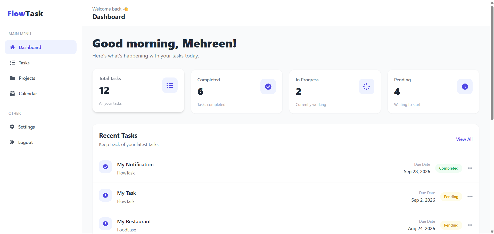
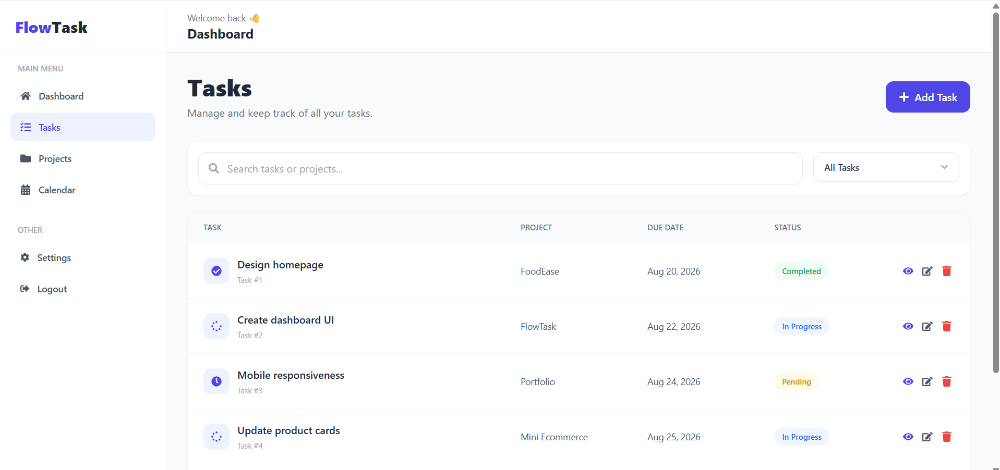
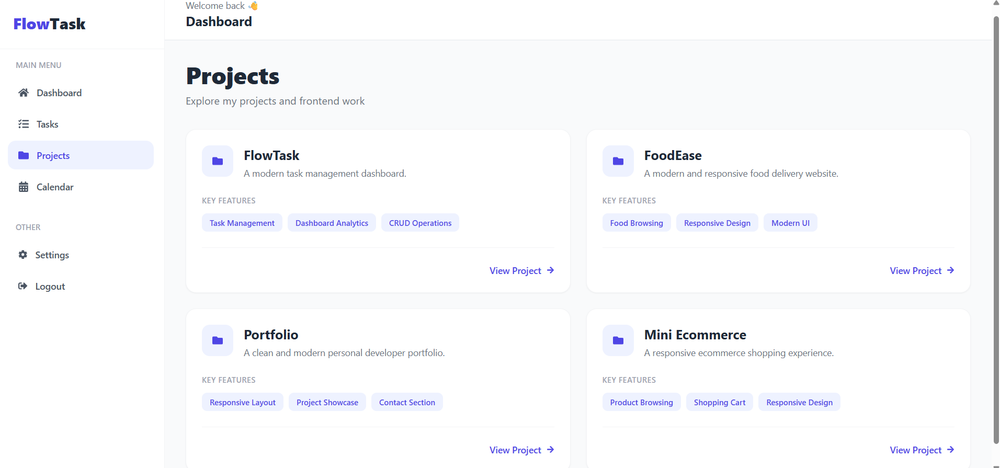

# FlowTask Dashboard

A modern and responsive task management dashboard built with **React.js** and **Tailwind CSS**.

FlowTask is designed to help users organize tasks, manage projects, track progress, and stay productive through a clean and user-friendly dashboard interface.

## 🚀 Tech Stack

* React.js
* JavaScript
* Tailwind CSS
* React Router
* Context API
* HTML5
* CSS3
* Vite
* React Icons
* LocalStorage

## ✨ Features

* Responsive dashboard
* Task management with CRUD operations
* Task search and status filtering
* Task details and editing
* Project management
* Project details
* Calendar view
* Settings page
* Dark mode
* Toast notifications
* Logout confirmation
* LocalStorage data persistence
* Mobile-friendly layout

## 📂 Main Sections

### 1. Dashboard

A clean dashboard providing an overview of tasks and project progress.

**Features:**

* Task statistics
* Recent tasks
* Project progress
* Upcoming tasks
* Productivity overview

---

### 2. Task Management

A complete task management interface for creating and organizing tasks.

**Features:**

* Add new tasks
* Edit tasks
* View task details
* Delete tasks
* Search tasks
* Filter tasks by status
* Due date management

---

### 3. Project Management

A project section for organizing and viewing different projects.

**Features:**

* Project listing
* Project details
* Project progress
* Technology information
* Responsive project cards

---

### 4. Calendar

A calendar interface for viewing and managing task deadlines.

**Features:**

* Monthly calendar view
* Task deadline display
* Month navigation
* Task status indicators
* Responsive layout

---

### 5. Settings

A settings section for managing dashboard preferences.

**Features:**

* User information
* Task status preferences
* Theme selection
* Task notifications
* Deadline reminders
* Dark mode

## 📸 Screenshots

### Dashboard



### Tasks



### Projects



## 🛠️ Getting Started

Clone the repository:

```bash
git clone https://github.com/mehreenkhurshid/flowtask-dashboard.git
```

Navigate to the project:

```bash
cd flowtask-dashboard
```

Install dependencies:

```bash
npm install
```

Start the development server:

```bash
npm run dev
```

The project will then be available on the local development server.

## 👩‍💻 About Me

I'm a **Frontend UI Developer** focused on creating modern, responsive, and user-friendly web interfaces using React.js, Next.js, Tailwind CSS, and JavaScript.

I enjoy turning ideas and designs into clean, functional, and responsive web experiences.

## 📬 Contact

**Email:** [mehreenkhurshid8@gmail.com](mailto:mehreenkhurshid8@gmail.com)

**GitHub:** https://github.com/mehreenkhurshid

**LinkedIn:** https://www.linkedin.com/in/mehreen-khurshid-9023562b6

## 📌 Project Status

FlowTask is a frontend-focused task management dashboard created to showcase React.js UI development, responsive design, component-based architecture, and frontend functionality.

---

⭐ Feel free to explore the repository and check out my projects.


